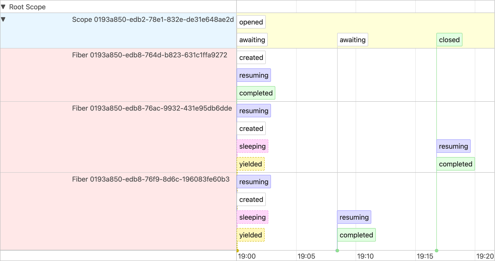
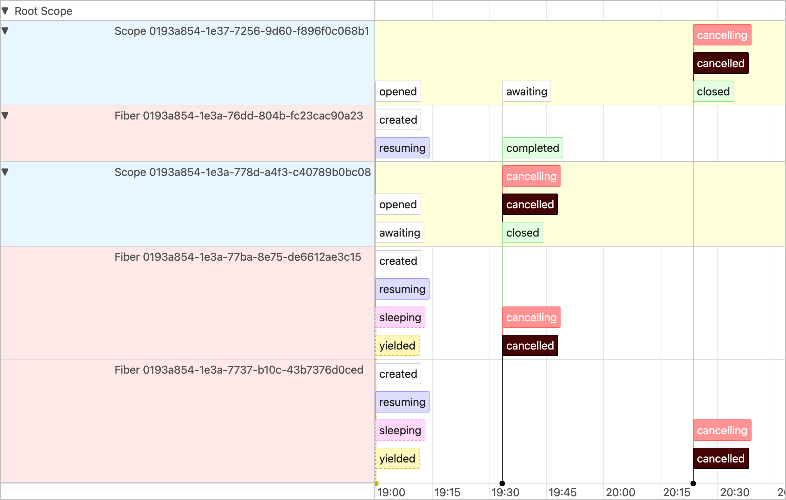
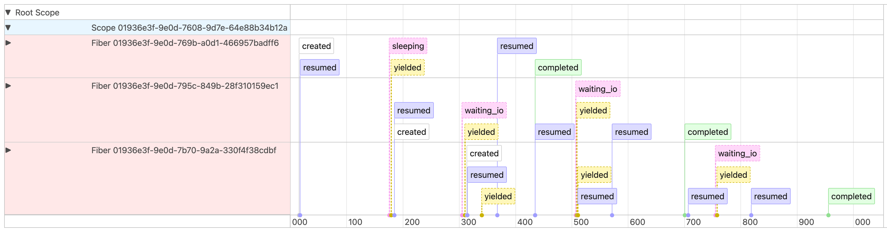
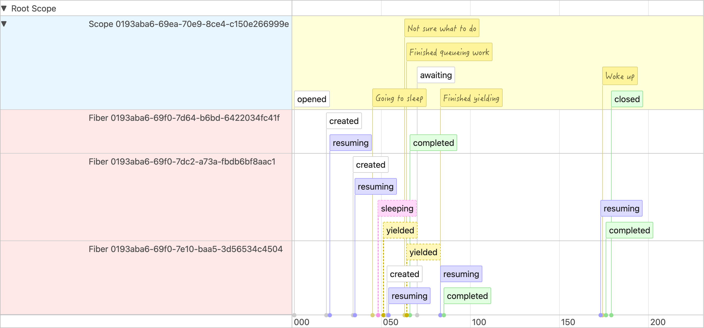
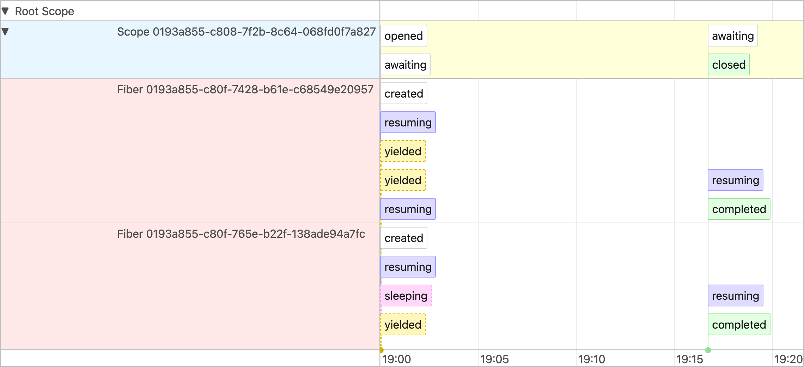
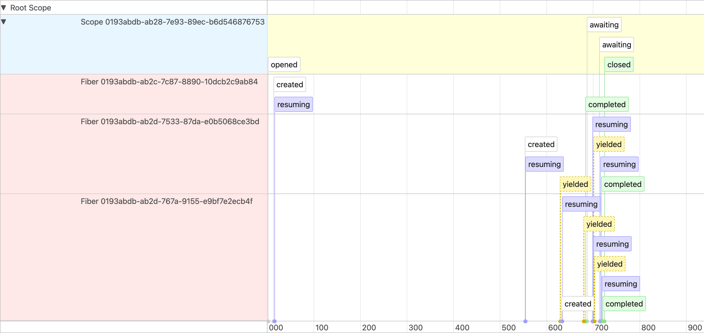
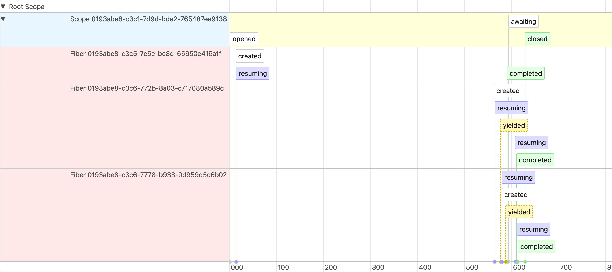
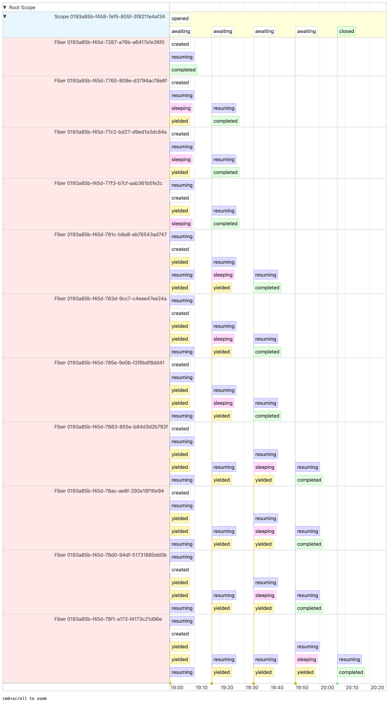

# Ori

Ori is a concurrency library for Ruby that provides a robust set of primitives for building concurrent applications. The name comes from the Japanese word 折り "ori" meaning "fold", reflecting how concurrent operations interleave.

Due to Ruby's GIL (Global Interpreter Lock), CRuby is unable to take advantage of a multi-threaded environment in the way that other languages do. Ori provides a set of primitives that allow you to build concurrent applications—that is, applications that interleave execution within a single thread—without blocking the entire Ruby interpreter for each task.

## Table of Contents

- [Installation](#installation)
- [Usage](#usage)
  - [Defining Boundaries](#defining-boundaries)
    - [Timeouts and Cancellation](#timeouts-and-cancellation)
    - [Debugging](#debugging)
  - [Concurrency Utilities](#concurrency-utilities)
    - [`Ori::Promise`](#oripromise)
    - [`Ori::Channel`](#orichannel)
    - [`Ori::Mutex`](#orimutex)
    - [`Ori::Semaphore`](#orisemaphore)
- [Releases](#releases)
- [License](#license)

## Installation

```ruby
gem "ori"
```

Then execute:

```sh
bundle install
```

## Usage

### Defining Boundaries

The core of Ori is the concurrency boundary, which provides a controlled environment for running fibers and managing their lifecycle. `Ori::Scope.boundary(&block)` is how you define a boundary, and will ensure all fibers within the boundary complete when the scope is closed, before continuing execution.

Within a boundary, you can use `Ori::Scope#fork(&block)` to run a new fiber. The fiber will run concurrently with other fibers in the boundary, and will be cancelled when the boundary is closed. If `#fork` isn't used, the code inside the boundary will run synchronously.

`Fiber.schedule(&block)`, provided by Ruby, is effectively identical to `#fork`, with the only difference being that `Ori::Scope#fork` can assign a new fiber to a parent scope, rather than only the active scope.

```ruby
Ori::Scope.boundary do |scope|
  # This runs in a new fiber
  scope.fork do
    sleep 1
    puts "Hello from fiber!"
  end

  # This doesn't wait for the first fiber to complete
  scope.fork do
    sleep 0.5
    puts "Another fiber here!"
  end
end

 # Boundary blocks until all fibers complete
 puts "Success!"
```

**Output:**

```
Another fiber here!
Hello from fiber!
Success!
```

As a convenience, `Ori::Scope` provides a `#fork_each` method that will fork a new fiber for each item in the enumerable. This can be useful for performing concurrent operations on a collection.

The following code contains six seconds of `sleep` time, but will take only ~1 second to execute due to the interleaving of the fibers:

```ruby
Ori::Scope.boundary do |scope|
  # Spawns a new fiber for each item in the array
  scope.fork_each([1, 2, 3]) do |item|
    puts "Processing #{item}"
    sleep(1)
  end

  # Any Enumerable can be used
  scope.fork_each(3.times) do |i|
    puts "Processing #{i}"
    sleep(1)
  end
end
```

<details>
<summary>See trace visualization</summary>


</details>

#### Timeouts and Cancellation

You can also use `Ori::Scope.boundary` with timeouts to automatically cancel or raise after a specified duration. When using `cancel_after(seconds)`, the scope will be cancelled but the boundary call will return normally. With `raise_after(seconds)`, a `Ori::Scope::CancellationError` will be raised after the specified duration. Both options will properly clean up any running fibers.

Nested cancellation scopes are fully supported - a parent scope's deadline will be inherited by child scopes, and cancelling a parent scope will cancel all child scopes:

```ruby
Ori::Scope.boundary(raise_after: 5) do |scope|
  # This inner scope inherits the 5 second deadline
  scope.fork do
    # Will raise `Ori::Scope::CancellationError` after 5 seconds
    sleep(10)
  end

  # This inner scope has a shorter deadline
  Ori::Scope.boundary(cancel_after: 2) do |inner_scope|
    inner_scope.fork do
      # Will be cancelled after 2 seconds
      sleep(10)
    end
  end
end
```

<details>
<summary>See trace visualization</summary>


</details>

### Debugging

To help understand your program, Ori comes with several utilities to help you visualize the execution of your program.

`Ori::Scope#print_ascii_trace` will print the trace to stdout in plaintext. While useful as a quick overview, it's not interactive and the level of detail is limited. 

```ruby
closed_scope = Ori::Scope.boundary { ... }
closed_scope.print_ascii_trace
```


```
Fiber Execution Timeline (0.001s)
==============================================================================================
Main       |▶.........↻.........................↻..................↻........................▒|
Fiber 1    |█▶═.╎------▶▒                                                                    |
Fiber 2    |   █▶═══~╎--▶~╎-----------------▶══~╎▶~╎------------▶══▒                         |
Fiber 3    |        █▶╎--▶╎----------------------▶╎----------------▶═~╎-----------------▶══▒ |
==============================================================================================
Legend: (█ Start) (▒ Finish) (═ Running) (~ IO-Wait) (. Sleeping) (╎ Yield) (✗ Error)
```

`Ori::Scope#write_html_trace(dir)` will generate an `index.html` file in the specified directory containing a fully interactive timeline of the scope's execution. 



`#write_html_trace` also supports use of `Ori::Scope#tag` to add custom labels to the trace.

```ruby
closed_scope = Ori::Scope.boundary do |scope|
  scope.fork do
    scope.tag("Going to sleep")
    sleep(0.0001)
    scope.tag("Woke up")
  end
  scope.fork do
    scope.tag("Not sure what to do")
    Fiber.yield
    scope.tag("Finished yielding")
  end
  scope.tag("Finished queueing work")
end

closed_scope.write_html_trace(File.join(__dir_, "out"))
```



### Concurrency Utilities

Ori comes with several utilities to help you build concurrent applications. Keep in mind that these utilities are not thread-safe and should only be used in a concurrent context. The particular usefulness of these utilities are primarily how they interact with the scheduler, yielding control back to other fibers when blocked.

#### `Ori::Promise`

Promises represent values that may not be immediately available. They're perfect for handling asynchronous operations.

```ruby
Ori::Scope.boundary do |scope|
  promise = Ori::Promise.new
  scope.fork do
    sleep 1
    promise.resolve("Hello from the future!")
  end
  # Wait for the promise to be fulfilled
  result = promise.await
  puts result # => "Hello from the future!"
end
```

<details>
<summary>See trace visualization</summary>


</details>

#### `Ori::Channel`

Channels provide a way to communicate between fibers by passing values between them:

```ruby
Ori::Scope.boundary do |scope|
  channel = Ori::Channel.new(5)
  # Producer
  scope.fork do
    5.times { |i| channel << i }
  end

  # Consumer
  scope.fork do
    5.times do
      puts "Received: #{channel.take}"
    end
  end
end
```

<details>
<summary>See trace visualization</summary>


</details>

Channels can be bounded to limit the number of items they can hold. When the channel is full, `put`/`<<` will block until there is room:

```ruby
channel = Ori::Channel.new(2)
scope.fork do
  5.times { |i| channel << i } # Will block after the first two puts
end
```

If a channel has a capacity of `0`, it becomes a simple synchronous queue:

```ruby
channel = Ori::Channel.new(0)
channel << 1 # Will block until `take` is called
```

#### `Ori::Mutex`

When you need to enforce a critical section with strict ordering, use a mutex:

```ruby
Ori::Scope.boundary do |scope|
  mutex = Ori::Mutex.new
  counter = 0
  5.times do
    scope.fork do
      mutex.synchronize do
        current = counter
        sleep 0.1 # Simulate work
        counter = current + 1
      end
    end
  end
end
```

<details>
<summary>See trace visualization</summary>


</details>

#### `Ori::Semaphore`

Semaphors are a generalized form of mutexes that can be used to control access to _n_ limited resources:

```ruby
Ori::Scope.boundary do |scope|
  # Allow up to 3 concurrent operations
  semaphore = Ori::Semaphore.new(3)
  10.times do |i|
    scope.fork do
      semaphore.synchronize do
        puts "Processing #{i}"
        sleep 1 # Simulate work
      end
    end
  end
end
```

<details>
<summary>See trace visualization</summary>


</details>

## Releases

This gem is published to [Cloudsmith](https://cloudsmith.io/~shopify/repos/gems/packages).

The procedure to publish a new release version is as follows:

* Update `lib/ori/version.rb`
* Run bundle install to bump the version of the gem in `Gemfile.lock`
* Open a pull request, review, and merge
* Review commits since the last release to identify user-facing changes that should be included in the release notes
* [Create a release on GitHub](https://github.com/Shopify/ori/releases/new) with a version number that matches `lib/ori/version.rb`
* [Deploy via Shipit](https://shipit.shopify.io/shopify/ori/cloudsmith)

## License

The gem is available as open source under the terms of the MIT License.
